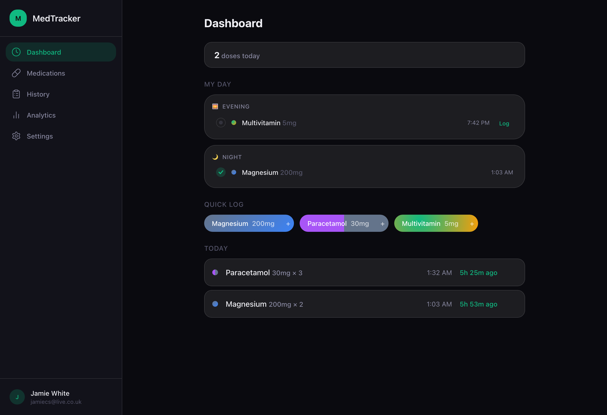
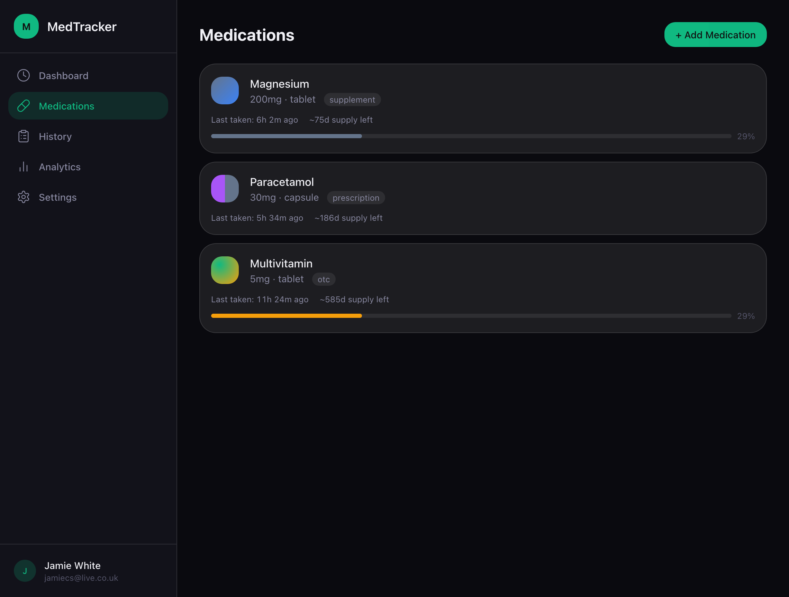
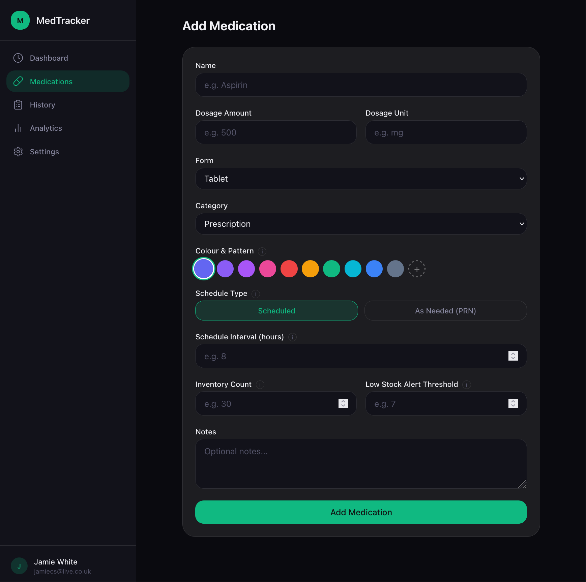
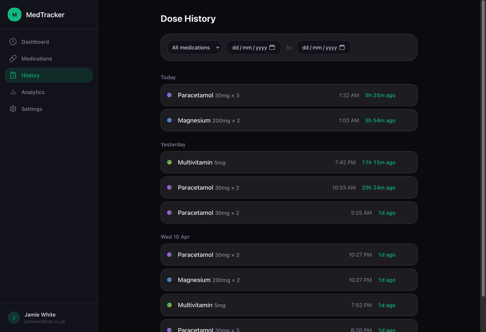
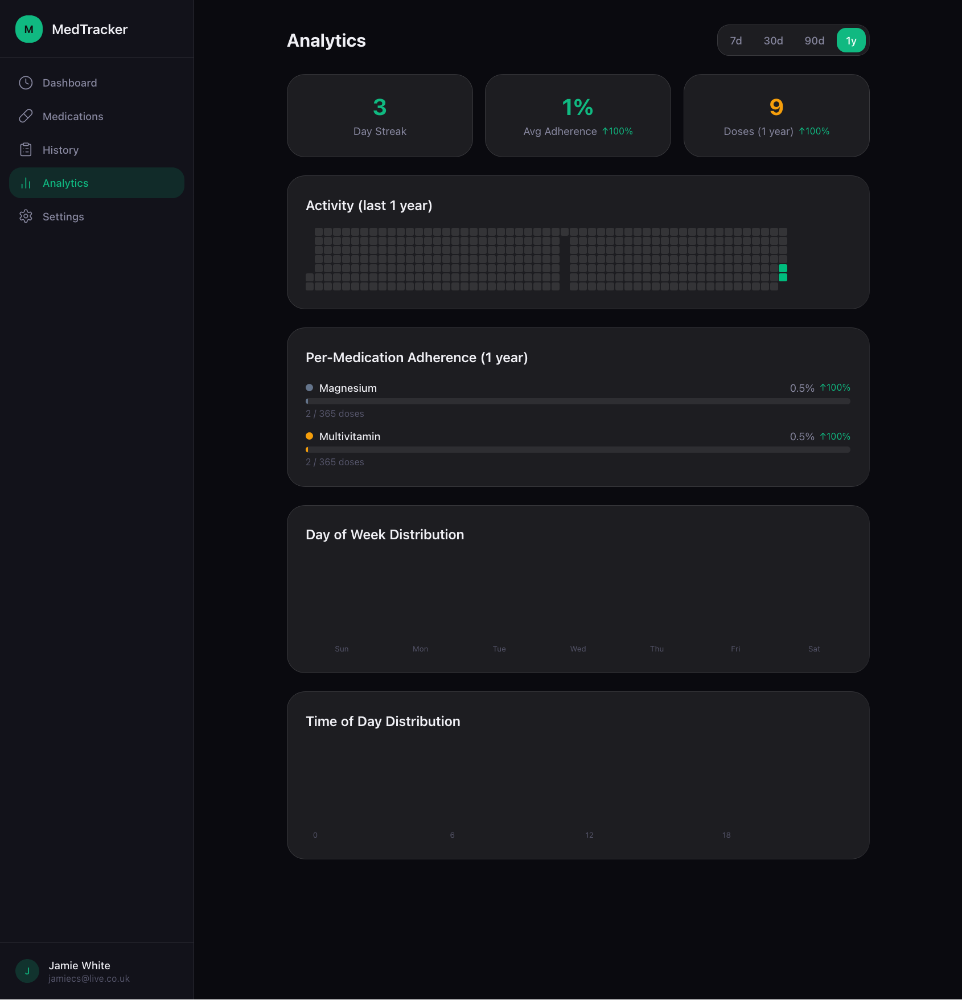

# MedTracker

A full-stack medication tracker focused on fast dose logging, live
timers, adherence analytics, secure auth, and exportable history.
Built with SvelteKit 2 (Svelte 5 runes), TypeScript, Drizzle ORM,
and Postgres.

[](https://github.com/JWhite212/medication-tracker/actions/workflows/ci.yml)
[](LICENSE)
[](https://nodejs.org)
[](https://svelte.dev)
[](https://vercel.com)

## Table of contents

1. [Overview](#overview)
2. [Live demo](#live-demo)
3. [Screenshots](#screenshots)
4. [Core features](#core-features)
5. [Feature status](#feature-status)
6. [Technical highlights](#technical-highlights)
7. [Architecture](#architecture)
8. [Security and privacy](#security-and-privacy)
9. [Database design](#database-design)
10. [Testing strategy](#testing-strategy)
11. [Local development](#local-development)
12. [Environment variables](#environment-variables)
13. [Known limitations](#known-limitations)
14. [Roadmap](#roadmap)
15. [What I learned](#what-i-learned)
16. [License](#license)

## Overview

MedTracker is a personal medication tracking web app. It is a
**tracking tool**, not medical advice — see the disclaimer surfaced
across the UI and the [medical disclaimer note](#medical-disclaimer)
below. The project is built as a portfolio piece: the goal is to
show end-to-end full-stack judgement, not to add yet another feature.

Read the long-form story in [`docs/case-study.md`](docs/case-study.md).

## Live demo

- App: <https://medication-tracker-jw.vercel.app>
- Demo account: `demo@medtracker.app` / `demo-medtracker-2026`.
  Seeded with five medications and ~30 days of dose history so the
  dashboard, log, and analytics pages reflect a populated state.

Refresh the demo (deletes and recreates the demo user, idempotent):

```bash
DATABASE_URL=... npm run seed:demo
```

## Screenshots



|                                                  |                                                        |
| ------------------------------------------------ | ------------------------------------------------------ |
|  |  |
| _Medications_                                    | _Add Medication_                                       |
|          |            |
| _History_                                        | _Analytics_                                            |

## Core features

- **Quick log** — single-tap dose logging with optimistic UI and
  audit trail.
- **Live timers** — per-medication "last taken" + "next due"
  countdowns recomputed every minute, with a `visibilitychange`
  catch-up.
- **Adherence analytics** — heatmap, daily counts, per-medication
  rollups, hourly + day-of-week distribution, side-effect frequency.
- **Reminders** — opt-in email and Web Push, dispatched by Vercel
  Cron with idempotent dedupe keys (see [ADR 0005](docs/adr/0005-reminder-deduplication.md)).
- **Exports** — PDF (with adherence summary, medication list,
  side-effect frequency, medical disclaimer) or CSV (formula-injection
  safe).
- **Auth** — email + password (Argon2id) and OAuth (Google, GitHub).
  TOTP 2FA with secrets encrypted at rest.

## Feature status

Honest about what's complete vs. what's planned:

| Feature                          | Status                                                                                                                |
| -------------------------------- | --------------------------------------------------------------------------------------------------------------------- |
| Email/password auth              | Complete                                                                                                              |
| OAuth (Google, GitHub)           | Complete; account-takeover guard in place                                                                             |
| 2FA (TOTP)                       | Complete; secrets encrypted at rest with AES-256-GCM                                                                  |
| Dose logging + edit + skip       | Complete; ownership-checked, status-aware                                                                             |
| Adherence analytics              | Complete; cap-at-100 + overuse split                                                                                  |
| Email reminders                  | Complete; idempotent via `reminder_events`                                                                            |
| Web Push reminders               | Complete                                                                                                              |
| PDF / CSV export                 | Complete; formula-injection escape, en-GB time format                                                                 |
| Drug interaction notice          | Experimental, behind `INTERACTIONS_ENABLED` flag                                                                      |
| Medical disclaimer               | Surfaced on landing, register, medication form, analytics, exports                                                    |
| Re-auth gate (sensitive actions) | Complete for change-password, enable/disable 2FA, delete account; **planned** for full export and revoke-all-sessions |
| Medication scheduling            | Interval, fixed-time, and PRN; multi-row schedules with optional day-of-week filters                                  |
| Demo account + seed              | Complete; `npm run seed:demo` (4c)                                                                                    |
| End-to-end tests                 | **Planned**; unit tests cover security primitives                                                                     |

## Technical highlights

- **Server-first SvelteKit** — every mutation is a form action; no
  client-side data fetching for write paths. See [ADR 0003](docs/adr/0003-server-first-form-actions.md).
- **AES-256-GCM at rest** for TOTP secrets with versioned payload
  format (`v1:iv:tag:ct`) and a one-shot migration script
  (`scripts/encrypt-totp-secrets.ts`).
- **Idempotent reminder dispatch** via unique `dedupe_key` rows in
  `reminder_events`. See [ADR 0005](docs/adr/0005-reminder-deduplication.md).
- **Centralised time formatting** — `formatUserTime(date, tz, '12h'|'24h')`
  threaded through dashboard, timeline, log, exports, emails so
  everything agrees.
- **Hardened CSV escaping** — `escapeCsvCell` neutralises formula
  injection prefixes (`= + - @ \t \r`) plus standard CSV escape
  rules; CRLF line endings per RFC 4180.
- **Coverage thresholds as regression floors** — measured baseline
  in `vite.config.ts`, set just below current so legitimate refactor
  noise doesn't fail CI but real regressions do.

## Architecture

```
+-------------------+
|  Browser / PWA    | <-- service worker for offline shell + push
+---------+---------+
          |
          v
+---------+---------+         +--------------------+
|  SvelteKit edge   |  -->    |  Resend (email)    |
|  (Vercel)         |         +--------------------+
|                   |
|  - Loaders        |         +--------------------+
|  - Form actions   |  -->    |  Web Push          |
|  - API endpoints  |         +--------------------+
|  - Cron handler   |
+---------+---------+         +--------------------+
          |                   |  OpenFDA labels    |
          | Drizzle ORM       |  (feature-flagged) |
          v                   +--------------------+
+---------+---------+
| Postgres (Neon)   |
| users · sessions  |
| medications       |
| dose_logs (status)|
| reminder_events   |
| reauth_tokens     |
| audit_logs ...    |
+-------------------+
```

The architectural decisions are recorded in [`docs/adr/`](docs/adr/).

## Security and privacy

- **Passwords** hashed with Argon2id (`@node-rs/argon2`).
- **Sessions** are server-side rows; revocable from settings, all
  invalidated after a password reset.
- **TOTP secrets** encrypted at rest (AES-256-GCM, see Phase 1).
- **OAuth** refuses auto-link to a password-bearing account
  (account-takeover prevention).
- **Re-auth gate** for sensitive actions writes a row to
  `reauth_tokens` for audit.
- **Rate limits** on login and password reset (`rate_limits` table).
- **CSRF** by SvelteKit form action default; OAuth state cookie
  with `secure: !dev`.
- **At rest**: Neon Postgres encrypted by the provider; SSL
  required (`?sslmode=require` in `DATABASE_URL`).

### Medical disclaimer

> MedTracker is a personal tracking tool. It does not provide
> medical advice, dosage recommendations, diagnosis, or emergency
> guidance. Always follow advice from a qualified healthcare
> professional.

## Database design

See [`docs/database.md`](docs/database.md) for the full table-by-table
reference, indexes, and migration workflow. Quick summary:

| Table                                                | Purpose                                                |
| ---------------------------------------------------- | ------------------------------------------------------ |
| `users`, `sessions`, `oauth_accounts`                | Auth core                                              |
| `email_verification_tokens`, `password_reset_tokens` | Email flows (hashed tokens)                            |
| `medications`                                        | User-owned; colours, pattern, schedule                 |
| `dose_logs`                                          | One row per logged dose; `status` taken/skipped/missed |
| `audit_logs`                                         | Append-only diff log                                   |
| `user_preferences`                                   | Per-user UI/format/reminder settings                   |
| `rate_limits`                                        | Sliding-window login + reset rate limit                |
| `push_subscriptions`                                 | Web Push endpoints                                     |
| `reminder_events`                                    | Idempotency key for cron dispatch                      |
| `reauth_tokens`                                      | Sensitive-action re-auth audit                         |

## Testing strategy

- **Unit tests** — Vitest. Coverage scoped to `src/lib/**` so
  routes (which need E2E) don't inflate the denominator. Provider:
  v8. Reporters: text, html, lcov, json-summary.
- **Coverage thresholds** — baseline measured at end of Phase 3,
  thresholds set just below to fail CI on regression.
- **E2E** — Playwright; the smoke spec is a placeholder for now,
  the full journey + axe-core a11y suite is on the roadmap.
- **CI** — GitHub Actions: install → check → lint → format-check
  → test (with coverage upload) → build. See `.github/workflows/ci.yml`.

```bash
npm test                # unit tests
npm run test:coverage   # unit tests with v8 coverage
npm run test:e2e        # Playwright (requires dev server)
```

## Local development

```bash
git clone https://github.com/JWhite212/medication-tracker.git
cd medication-tracker
npm install
cp .env.example .env    # fill in DATABASE_URL at minimum

npm run db:migrate      # apply Drizzle migrations
npm run dev             # start dev server on :5173
```

Other handy commands:

| Command               | Purpose                          |
| --------------------- | -------------------------------- |
| `npm run check`       | Type-check (svelte-check)        |
| `npm run lint`        | ESLint                           |
| `npm run format`      | Prettier --write                 |
| `npm run db:generate` | Diff schema → new migration file |
| `npm run db:studio`   | Open Drizzle Studio              |

## Environment variables

The full annotated list lives in [`.env.example`](.env.example).
Required: `DATABASE_URL`. Everything else is optional and disables
the corresponding feature when unset (OAuth, email, push,
interactions).

## Known limitations

- **End-to-end tests** are stubbed; the unit suite covers crypto,
  TOTP, CSV escape, and analytics primitives but not full user
  journeys.
- **Drug interactions** require a deliberate `INTERACTIONS_ENABLED=true`
  to turn on, and even then the warning panel is labelled
  "Experimental" — false positives are expected.

## Roadmap

Tracked across four implementation phases, with the source plan in
[`.claude/PRPs/plans/improvements-broad.plan.md`](.claude/PRPs/plans/improvements-broad.plan.md):

- **Phase 1 hardening** — ownership guards, status column, reminder
  dedup, secure cookies, TOTP encryption, re-auth gate, session
  invalidation, CSV/PDF safety. **Done.**
- **Phase 2 repo quality** — ESLint, Prettier, CI, coverage,
  Drizzle scripts, env documentation. **Done.**
- **Phase 3 tests** — unit tests for crypto, TOTP, CSV, analytics,
  interactions; coverage thresholds. **Done.**
- **Phase 4 polish** — keyboard shortcuts fix, interactions feature
  flag, medical disclaimer (4a). README, ADRs, case study (4b).
  Demo seed account (4c). Multi-row schedule refactor (4d). **Done.**

## What I learned

Captured in [`docs/case-study.md`](docs/case-study.md) §7. Tl;dr:
server-first removes a class of bugs, CI surfaces what's load-bearing,
and a small correct schema beats a clever ORM.

## License

[MIT](LICENSE)
