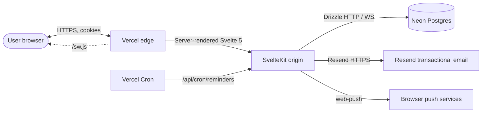
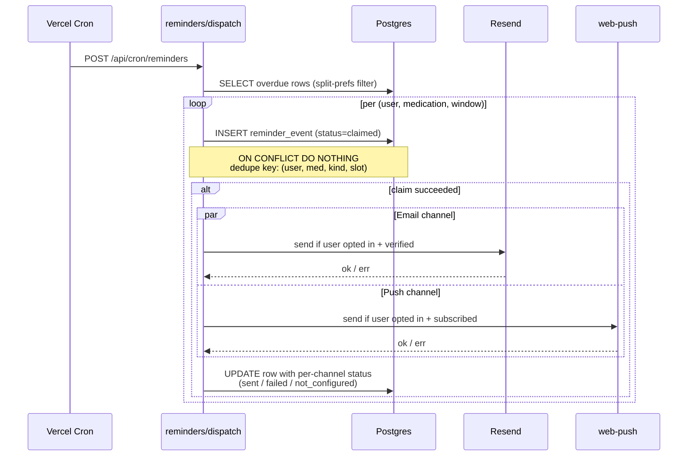
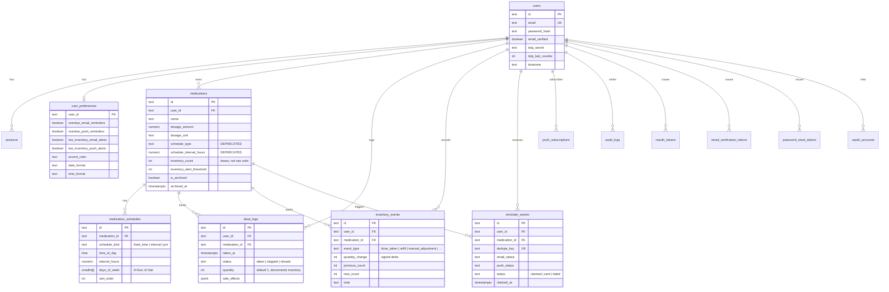

# Architecture

MedTracker is a server-first SvelteKit app with progressive enhancement.
Pages load via `+page.server.ts`, mutations run as form actions with
`use:enhance`, and there are no client-side data fetching libraries.
Authenticated routes live under the `(app)` route group, gated by
`+layout.server.ts`.

## System overview

- **Edge / origin split.** Vercel's adapter runs SvelteKit on Node 22 and
  serves built static assets from the edge. The service worker at
  `/sw.js` adds offline fallbacks for GET requests and powers Web Push
  delivery.
- **Origin-only data flow.** Every read goes through `+page.server.ts`,
  every write goes through a form action. The browser never queries
  the database directly.
- **Background work** runs on Vercel Cron at `/api/cron/reminders`,
  triggering `checkOverdueMedications` and `checkLowInventory` over
  the same dispatch surface used by manual triggers.

## Reminder dispatch flow

The reminder pipeline is the system's most stateful surface — it must
not double-send, must claim work atomically, and must record per-channel
status so retries pick up only the truly-failed channel.

Key invariants:

- Pre-claim happens **before** any network call. A duplicate cron
  invocation can't race past the unique dedupe key.
- Each channel records `sent`, `failed`, or `not_configured`
  independently. A push outage only retries push.
- The verify-email gate (`emailVerified=false`) demotes email to
  `not_configured` even if the user opted in — protects against
  reflective spam through unverified addresses.

See `src/lib/server/reminders.ts` and `src/lib/server/reminders/dispatch.ts`.

## Data model

The schema is defined once in `src/lib/server/db/schema.ts`. The diagram
below is a high-level view; see `docs/database.md` for column-level
detail.

Notes worth keeping in mind:

- `medications.schedule_type` and `schedule_interval_hours` are
  deprecated — read `medication_schedules` first. They remain populated
  for compatibility with read paths that haven't migrated yet.
- `inventory_events` is the audit trail for `medications.inventory_count`.
  Every change to `inventory_count` (dose taken, dose deleted, refill,
  manual adjustment) writes a corresponding event in the same
  transaction.
- `reminder_events.dedupe_key` is `(user_id, medication_id,
reminder_kind, slot)` and carries a unique constraint — the
  pre-claim insert is the cheapest possible "did we already process
  this?" check.

## Where to look in the code

| Concern                              | Path                                                   |
| ------------------------------------ | ------------------------------------------------------ |
| Schema (single source of truth)      | `src/lib/server/db/schema.ts`                          |
| Auth (sessions, OAuth, TOTP, reauth) | `src/lib/server/auth/`                                 |
| Reminder dispatch                    | `src/lib/server/reminders.ts`, `reminders/dispatch.ts` |
| Inventory events                     | `src/lib/server/inventory-events.ts`                   |
| Analytics aggregations               | `src/lib/server/analytics.ts`                          |
| Email                                | `src/lib/server/email.ts`                              |
| Service worker (offline + push)      | `src/service-worker.ts`                                |
| Cron entrypoint                      | `src/routes/api/cron/reminders/+server.ts`             |
