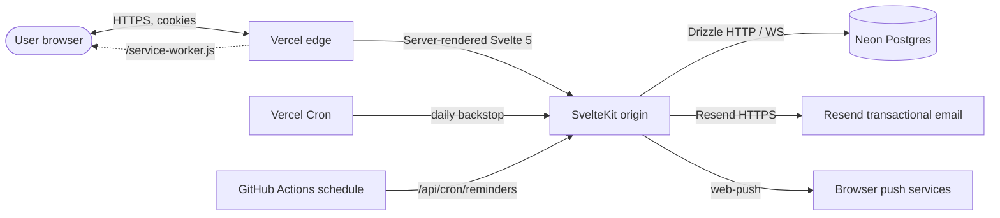
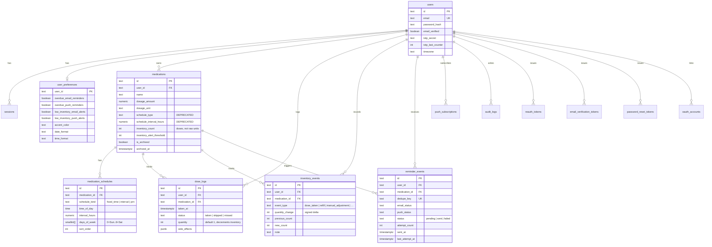

# Architecture

MedTracker is a server-first SvelteKit app with progressive enhancement.
Pages load via `+page.server.ts`, mutations run as form actions with
`use:enhance`, and there are no client-side data fetching libraries.
Authenticated routes live under the `(app)` route group, gated by
`+layout.server.ts`.

## System overview

```mermaid
flowchart LR
    User([User browser]) <-->|HTTPS, cookies| Vercel[Vercel edge]
    Vercel -->|Server-rendered Svelte 5| Origin[SvelteKit origin]
    Origin -->|Drizzle HTTP / WS| Neon[(Neon Postgres)]
    Origin -->|Resend HTTPS| Resend[Resend transactional email]
    Origin -->|web-push| WebPush[Browser push services]
    Cron[Vercel Cron] -->|daily backstop| Origin
    GHA[GitHub Actions schedule] -->|/api/cron/reminders| Origin
    Vercel -.->|/service-worker.js| User
```

- **Edge / origin split.** Vercel's adapter runs SvelteKit on Node 22 and
  serves built static assets from the edge. The service worker is
  `src/service-worker.ts`, built to `/service-worker.js` and registered
  automatically by SvelteKit — it adds offline fallbacks for GET
  requests and powers Web Push delivery. There must only ever be one:
  registrations are keyed by scope, so a second script registered at
  `/` evicts the first on every load.
- **Origin-only data flow.** Every read goes through `+page.server.ts`,
  every write goes through a form action. The browser never queries
  the database directly.
- **Background work** runs at `/api/cron/reminders`, triggering
  `checkOverdueMedications` and `checkLowInventory` over the same
  dispatch surface used by manual triggers. It is driven twice: the
  Vercel Cron in `vercel.json` as a guaranteed daily backstop, and the
  `reminder-tick` GitHub Actions schedule every 30 minutes for timely
  delivery, because the Hobby plan caps Vercel crons at one run a day.
  The GitHub Actions schedule only runs 06:00–22:59 UTC
  (`.github/workflows/reminder-tick.yml`), so the Vercel cron is the
  sole backstop through the overnight gap — the reason a nag's ordinal
  clamps at `notifyMaxRepeats` rather than being cut off outright.
  Both paths authenticate with the same `CRON_SECRET` bearer token, and
  the dispatcher dedupes on a per-slot key so overlapping runs are
  safe.

## Reminder dispatch flow

The reminder pipeline is the system's most stateful surface — it must
not double-send, must claim work atomically, and must record per-channel
status so retries pick up only the truly-failed channel.

```mermaid
sequenceDiagram
    participant Scheduler as Vercel Cron / GitHub Actions
    participant Dispatch as reminders/dispatch
    participant DB as Postgres
    participant Email as Resend
    participant Push as web-push

    Note over Scheduler,Dispatch: Two independent schedulers hit this endpoint:<br/>Vercel Cron (daily backstop) and the reminder-tick<br/>GitHub Actions workflow (every 30 min). Both carry<br/>the same CRON_SECRET bearer.
    Scheduler->>Dispatch: POST /api/cron/reminders
    Dispatch->>DB: SELECT overdue rows (split-prefs filter)
    loop per (user, medication, window)
        Dispatch->>DB: INSERT reminder_event<br/>ON CONFLICT (dedupe_key) DO UPDATE ... WHERE retryable
        Note over Dispatch,DB: claimReminderSlot: a fresh key inserts as status=pending;<br/>an existing key is reclaimed only if (failed OR pending) AND<br/>attempts remain AND the retry cooldown has elapsed — the cooldown<br/>gates both statuses equally. Otherwise no row is returned and the<br/>attempt is skipped.
        alt claim succeeded
            par Email channel
                Dispatch->>Email: send if user opted in + verified
                Email-->>Dispatch: ok / err
            and Push channel
                Dispatch->>Push: send if user opted in + subscribed
                Push-->>Dispatch: ok / err
            end
            Dispatch->>DB: UPDATE row: status derived from channel<br/>results (sent / failed), plus per-channel<br/>status (sent / failed / not_configured)
        end
    end
```

Key invariants:

- Pre-claim happens **before** any network call. A duplicate cron
  invocation can't race past the unique dedupe key.
- Each channel records `sent`, `failed`, or `not_configured`
  independently. A push outage only retries push.
- The verify-email gate (`emailVerified=false`) demotes email to
  `not_configured` even if the user opted in — protects against
  reflective spam through unverified addresses.

See `src/lib/server/reminders.ts` and `src/lib/server/reminders/dispatch.ts`.

## Data model

The schema is defined once in `src/lib/server/db/schema.ts`. The diagram
below is a high-level view; see `docs/database.md` for column-level
detail.

```mermaid
erDiagram
    users ||--o{ sessions : "has"
    users ||--o| user_preferences : "has"
    users ||--o{ medications : "owns"
    users ||--o{ dose_logs : "logs"
    users ||--o{ inventory_events : "records"
    users ||--o{ reminder_events : "receives"
    users ||--o{ push_subscriptions : "subscribes"
    users ||--o{ audit_logs : "writes"
    users ||--o{ reauth_tokens : "issues"
    users ||--o{ email_verification_tokens : "issues"
    users ||--o{ password_reset_tokens : "issues"
    users ||--o{ oauth_accounts : "links"

    medications ||--o{ medication_schedules : "has"
    medications ||--o{ dose_logs : "tracks"
    medications ||--o{ inventory_events : "tracks"
    medications ||--o{ reminder_events : "triggers"

    users {
        text id PK
        text email UK
        text password_hash
        boolean email_verified
        text totp_secret
        int totp_last_counter
        text timezone
    }
    medications {
        text id PK
        text user_id FK
        text name
        numeric dosage_amount
        text dosage_unit
        text schedule_type "DEPRECATED"
        numeric schedule_interval_hours "DEPRECATED"
        int inventory_count "doses, not raw units"
        int inventory_alert_threshold
        boolean is_archived
        timestamptz archived_at
    }
    medication_schedules {
        text id PK
        text medication_id FK
        text schedule_kind "fixed_time | interval | prn"
        time time_of_day
        numeric interval_hours
        smallint[] days_of_week "0=Sun..6=Sat"
        int sort_order
    }
    dose_logs {
        text id PK
        text user_id FK
        text medication_id FK
        timestamptz taken_at
        text status "taken | skipped | missed"
        int quantity "default 1, decrements inventory"
        jsonb side_effects
    }
    inventory_events {
        text id PK
        text user_id FK
        text medication_id FK
        text event_type "dose_taken | refill | manual_adjustment | …"
        int quantity_change "signed delta"
        int previous_count
        int new_count
        text note
    }
    reminder_events {
        text id PK
        text user_id FK
        text medication_id FK
        text dedupe_key UK
        text email_status
        text push_status
        text status "pending | sent | failed"
        int attempt_count
        timestamptz sent_at
        timestamptz last_attempt_at
    }
    user_preferences {
        text user_id PK
        boolean overdue_email_reminders
        boolean overdue_push_reminders
        boolean low_inventory_email_alerts
        boolean low_inventory_push_alerts
        text accent_color
        text date_format
        text time_format
    }
```

Notes worth keeping in mind:

- `medications.schedule_type` and `schedule_interval_hours` are
  deprecated — read `medication_schedules` first. They remain populated
  for compatibility with read paths that haven't migrated yet.
- `inventory_events` is the audit trail for `medications.inventory_count`.
  Every change to `inventory_count` (dose taken, dose deleted, refill,
  manual adjustment) writes a corresponding event in the same
  transaction.
- `reminder_events.dedupe_key` carries a unique constraint, but
  claiming it is `ON CONFLICT DO UPDATE ... WHERE <retryable>`, not a
  plain insert-or-skip — see the sequence diagram above and
  `docs/database.md` for the exact key format per reminder type, and
  [ADR 0005](adr/0005-reminder-deduplication.md) for why the overdue
  key's ordinal is bounded rather than unbounded.

## Where to look in the code

| Concern                              | Path                                                   |
| ------------------------------------ | ------------------------------------------------------ |
| Schema (single source of truth)      | `src/lib/server/db/schema.ts`                          |
| Auth (sessions, OAuth, TOTP, reauth) | `src/lib/server/auth/`                                 |
| Reminder dispatch                    | `src/lib/server/reminders.ts`, `reminders/dispatch.ts` |
| Inventory events                     | `src/lib/server/inventory-events.ts`                   |
| Analytics aggregations               | `src/lib/server/analytics.ts`                          |
| Email                                | `src/lib/server/email.ts`                              |
| Service worker (offline + push)      | `src/service-worker.ts`                                |
| Cron entrypoint                      | `src/routes/api/cron/reminders/+server.ts`             |
